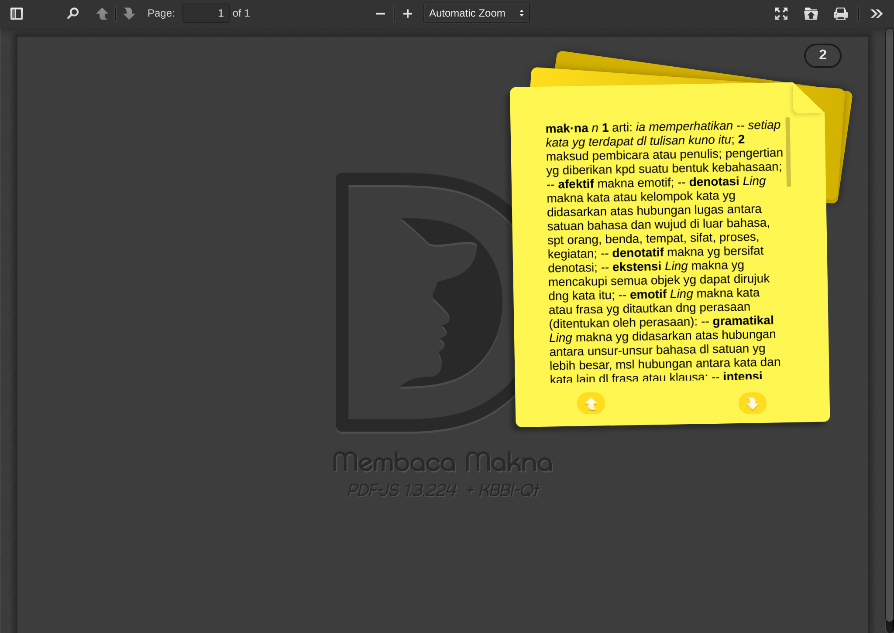

 
## Prakata
Terdapat begitu banyak ragam  kata maupun istilah yang beredar dalam tata kalimat kita, baik itu berupa lisan / tulisan yang terkadang masih asing  dan belum terindeks dalam list perbendaharaan kata kita.

Ibarat menelan makanan tanpa dikunyah terlebih dahulu, tentu makanan itu akan nyangkut di tenggorokan atau bahkan akan termuntahkan kembali, sebab jika kata merupakan perwujudan atas suatu kesatuan perasaan dan pikiran yang dapat digunakan dalam berbahasa belum dapat dicerna dengan benar, lalu bagaimana mungkin kita dapat menyerap seluruh nutrisi yang menjadi saripati dari sebuah istilah yang mana ia adalah sebuah gabungan kata yang dengan cermat meng-ungkapkan makna suatu konsep, proses, keadaan, atau sifat yang khas dalam bidang tertentu. 

Atas dasar kebutuhan untuk mencerna makna kala sedang membaca, terlebih lagi agar tak keliru dalam memahami maksud berikut konteks bacaan inilah yang kemudian mendorong saya untuk sekedar menggabungkan dua unsur parsial yang biasanya di gunakan *( saya jalankan )* secara terpisah : e-book Reader *( PDF Reader )* dan KBBI menjadi satu kesatuan agar mempermudah kita sebagai pembaca dalam menelaah makna.
    
Semoga Berguna & Bermanfaat.

## Penggunaan
1. Buka sebuah file berekstensi pdf yang hendak dibaca.
2. Seleksi "sebuah kata" *(Block)* yang ingin di ketahui maknanya.
3. Click kanan pada kata tersebut.

    ➡️ [Demo](https://dvd-azr.github.io/makna-kata/)
    
## Library
 - <strong>[PDF.js](https://mozilla.github.io/pdf.js/)</strong> Portable Document Format (PDF) HTML5 `v1.3.224`

## Sumber Data
- <strong>[KBBI-Qt](https://github.com/bgli/kbbi-qt)</strong> Kamus Besar Bahasa Indonesia `v1.0.0` 